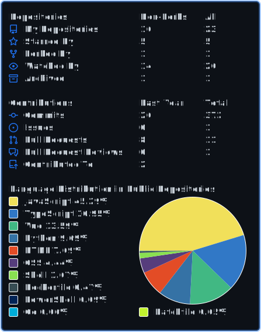

# Thu Pham Xuan

  
  

    
    
    
    
  

  
  <h1>
  Howdy there!
    
  </h1>
  

    
  

---

### :technologist: Who I am?

I am a funny fullstack NodeJS developer :beetle: from Vietnam :vietnam: :vietnam: :vietnam:

- :computer: I'm working as a fulltime freelancer, happy to join with your team, reach me on 

- :camera_flash: Traveling and photographing.

- :coffee: I love to read technical newsletters and sometimes hang out with my friends in my free time.

- 🎉 I am a cheerful and sociable person. Feel free to chat with me on 

---

### :hammer_and_wrench: Languages and Tools

I am experienced with a variety of languages and tools, and I am also willing to learn new ones.
They include, but are not limited to:

- #### Programming languages/Platforms

  
  
  
  

- #### Client Side/UI Frameworks

  
  
  
  
  
  
  

- #### Server Side Frameworks

  
  
  
  
  
  

- #### Databases

  
  
  

- #### Cloud Providers

  
  
  
  

---

### :fire: Stats

